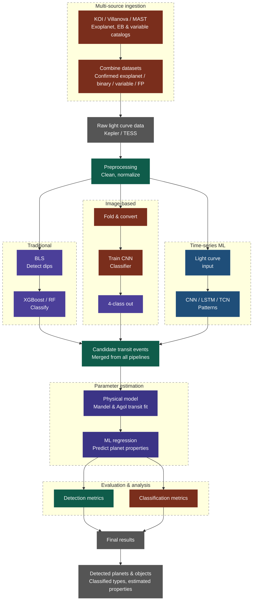

# 567 Machine Learning Project - Spring 2026

- [567 Machine Learning Project - Spring 2026](#567-machine-learning-project---spring-2026)
  - [Introduction](#introduction)
  - [Combined Project Flowchart](#combined-project-flowchart)
  - [Links \& References](#links--references)

## Introduction

Project for CSCI 567 Machine Learning in Spring 2026 on light curve analysis of distant stars to detect exoplanets.

## Combined Project Flowchart

---

## Links & References

> [!NOTE]
>
> 1. [NASA EXP Archives](https://exoplanetarchive.ipac.caltech.edu/index.html)
> 2. [MAST Landing Page](https://mast.stsci.edu/portal/Mashup/Clients/Mast/Portal.html)
> 3. [MAST Notebook Repo](https://spacetelescope.github.io/mast_notebooks/notebooks/GALEX/mis_mosaic/mis_mosaic.html#about-this-notebook)
> 4. [Beginner Introductory Notebooks for `Lightkurve`](https://spacetelescope.github.io/mast_notebooks/notebooks/Kepler/beginner.html)
> 5. [Getting and Processing `Lightkurve` data](https://spacetelescope.github.io/mast_notebooks/notebooks/Kepler/lightkurve_analyzing_lc_products/lightkurve_analyzing_lc_products.html)
> 6. [Kaggle Notebook on Exoplanet Detection with CNNs](https://www.kaggle.com/code/huyghens/ai-model-for-the-detection-of-exoplanets/notebook#Future-work)
> 7. [Kaggle Notebook AI Model for the Detection of Exoplanets](https://www.kaggle.com/code/jaimetrickz/exoplanet-classification/notebook#KNN-Classifier)
> 8. [Kepler Eclipsing Binary Catalog](https://keplerebs.villanova.edu/)
