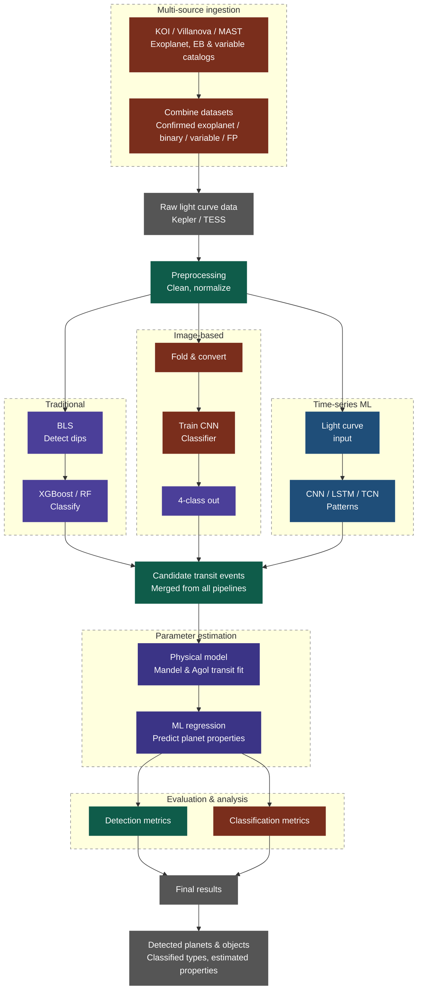

# 567 Machine Learning Project - Spring 2026

- [567 Machine Learning Project - Spring 2026](#567-machine-learning-project---spring-2026)
  - [Todo](#todo)
  - [Introduction](#introduction)
  - [Project Flowchart](#project-flowchart)
  - [Challenges](#challenges)
    - [Funky File Handling \& Downloads for K2VarCat](#funky-file-handling--downloads-for-k2varcat)
    - [The Data Challenge](#the-data-challenge)
  - [Links \& References](#links--references)

## Todo

- [ ] Merge datasets
  - [X] The Data Challenge
  - [X] Pull data across sources for VKEB matching KICs
    - [X] Test workflow outside of `pandas`
    - [X] Test creating stacks of curls for KICs
      - [X] Dynamically generate script of curl commands for each KIC in list of KICs
      - [X] Convert curl commands to .txt file of links
      - [X] Download KIC LCs with links
      - [X] Load and inspect LCs from downloaded LC `.fits` files
      - Testing
        - [X] Sample LCs in K2VC similarly to KEB
  - [X] Pull data from other sources
    - [X] KOI Cumulative Catalog - Tom and Jithin
      - [X] Generate `curl` scripts
        - Hint: See `/test-code/create-list-curl-urls-kepler.py`
        - Seealso: `python3 get_kepler.py -h`
      - [X] Download LCs with as high fidelity as possible
      - [X] Extract LC arrays (time, flux, flux_err, n_points)
      - [X] Store in combined dataframe
      - [X] Pickle dataframe and upload to Google Drive
    - [X] Variable stars (K & D)
      - [X] Decide how many records to get from K2VarCat (Discuss class imbalance)
      - [X] Download LCs, how many ever we need
  - [ ] Put all datasets together
    - [ ] Import all datasets
    - [ ] Normalize, detrend
    <!-- - [ ] `Create load-data/` -->
- [ ] Machine Learning
- [ ] Work on documentation

---

## Introduction

Project for CSCI 567 Machine Learning in Spring 2026 on light curve analysis of distant stars to detect exoplanets.

## Project Flowchart



## Challenges

### Funky File Handling & Downloads for K2VarCat

Used the following command to extract 7000+ MAST links:

```bash
awk '/^curl -O / {print $3}' k2varcat-c{01,02,03,04}_curl.sh > k2-c{01,02,03,04}-urls.txt
```

And using `aria2` to download them all with parallel processing:

```bash
aria2c \
  -i /tmp/k2_urls.txt \
  -d . \
  -j 10 \
  -x 1 \
  -s 1 \
  -c \
  --max-tries=0 \
  --retry-wait=5 \
  --timeout=60 \
  --connect-timeout=60 \
  --check-integrity=true
```

### The Data Challenge

When first starting to explore retrieving data with MAST, we noticed that it took close to 40s to run a query the NASA Exoplanet Archive with `astropy`. While this was to query the Archive and not MAST, we found that there was a different way to query MAST not just using `astropy`, but other methods as well.

These methods vary with different levels of convenience (and ease-of-use in syntax) but with the trade-off of having less control over the data/mission we were querying. Here's a table talking about ways to query the MAST dataset and what these methods allow you to have access to.

> [!TIP]
> These three are just different client layers on top of MAST and the difference in the efficiency comes down ot query overhead and how much client-side work happens before/after the download.

| Tool                                      | Scope                                                                                                                                                                                                                                                   | Best at                                                                                                                   | Kepler/K2-specific behavior                                                                                                                                                                                                         | Main trade-off                                                                                                                     |
| ----------------------------------------- | ------------------------------------------------------------------------------------------------------------------------------------------------------------------------------------------------------------------------------------------------------- | ------------------------------------------------------------------------------------------------------------------------- | ----------------------------------------------------------------------------------------------------------------------------------------------------------------------------------------------------------------------------------- | ---------------------------------------------------------------------------------------------------------------------------------- |
| **`Observations`**                        | The primary MAST interface for observational metadata and products across missions; it uses the MAST Portal API and returns Astropy `Table` objects. It is described as the recommended starting point for most users. ([astroquery.readthedocs.io][1]) | Cross-mission searches, rich metadata filters, product discovery, and downloads. ([astroquery.readthedocs.io][1])         | You can query Kepler/K2 as part of the broader archive, but it is mission-agnostic rather than Kepler/K2-specialized. ([astroquery.readthedocs.io][1])                                                                              | More flexible, but usually more manual filtering on your side. ([astroquery.readthedocs.io][1])                                    |
| **`MastMissionsClass` (“Kepler helper”)** | The mission-search class in `astroquery.mast`; astroquery’s docs separate this from the general observation search interface. ([astroquery.readthedocs.io][2])                                                                                          | Staying inside one mission’s data model and search flow. ([astroquery.readthedocs.io][2])                                 | This is the mission-specific layer you would use when your intent is “Kepler/K2 only,” rather than all of MAST. That is a mission-specific design choice, so it is narrower than `Observations`. ([astroquery.readthedocs.io][2])   | Less general than `Observations`; better for focused mission queries than archive-wide discovery. ([astroquery.readthedocs.io][2]) |
| **Lightkurve**                            | A domain-specific package for Kepler/K2/TESS time-series work. It says it uses Astroquery to search MAST and provides `search_lightcurve`, `search_targetpixelfile`, and `search_tesscut`. ([lightkurve.github.io][3])                                  | Fast light-curve and target-pixel-file workflows: search, download, plot, stitch, and filter. ([lightkurve.github.io][4]) | `search_lightcurve()` accepts an object name, **KIC or EPIC ID**, or coordinates; its `mission` filter includes **Kepler** and **K2** by default; it also supports `author`, `quarter`, and `campaign`. ([lightkurve.github.io][5]) | Best for light curves and TPFs, not for arbitrary archive products or broad metadata exploration. ([lightkurve.github.io][4])      |

[1]: https://astroquery.readthedocs.io/en/latest/mast/mast_obsquery.html "Observation Queries — astroquery v0.1.dev269+gf7db6753c"
[2]: https://astroquery.readthedocs.io/en/stable/mast/mast.html "MAST Queries (astroquery.mast) — astroquery v0.4.11"
[3]: https://lightkurve.github.io/lightkurve/tutorials/1-getting-started/searching-for-data-products.html "Searching & downloading Kepler, K2, and TESS data — Lightkurve "
[5]: https://lightkurve.github.io/lightkurve/reference/api/lightkurve.search_lightcurve.html "lightkurve.search_lightcurve — Lightkurve "

Before we can apply machine learning techniques, or even build the combined dataset, we need to explore these ways of fetching MAST data and compare them for efficiency and use-case.

To sum things up, here's how these sources compare with what they return and what their level of access is.

| Layer                                                                                 | “Level of access”                                      | What you query                                                                                                                                                                                                                          | What you get back                                                                                                                          | How it behaves at scale                                                                                                                                                                                                                                                                                                                                                     |
| ------------------------------------------------------------------------------------- | ------------------------------------------------------ | --------------------------------------------------------------------------------------------------------------------------------------------------------------------------------------------------------------------------------------- | ------------------------------------------------------------------------------------------------------------------------------------------ | --------------------------------------------------------------------------------------------------------------------------------------------------------------------------------------------------------------------------------------------------------------------------------------------------------------------------------------------------------------------------- |
| **`Observations`**                                                                    | **Lowest-level / broadest control** for archive search | Mission-agnostic observational metadata and products across MAST, using positional, object-name, and metadata filters. It talks directly to the MAST Portal API. ([astroquery.readthedocs.io][1])                                       | Astropy tables of observations/products, which you can filter and then download. ([astroquery.readthedocs.io][1])                          | Best when you need **server-side filtering** over many targets or many criteria before downloading. This is the most scalable path for large batches because it gives you the most control over what comes back. That last part is an inference from the fact that it supports complex multi-criteria queries and returns tabular results. ([astroquery.readthedocs.io][1]) |
| **Kepler/K2 mission helper** (`astroquery.mast` mission search / `MastMissionsClass`) | **Middle layer / mission-specific control**            | Kepler/K2-only mission searches instead of the whole archive. Astroquery describes `MastClass` as direct programmatic access to the MAST Portal, alongside `ObservationsClass` for observational data. ([astroquery.readthedocs.io][2]) | Mission-scoped result tables and downloads. ([astroquery.readthedocs.io][2])                                                               | Good when your pipeline is **Kepler/K2-only** and you want to avoid broader archive logic. At scale, it reduces complexity compared with `Observations`, but it is still more manual than Lightkurve because you are still working close to archive/query concepts. This is an inference from the documented API structure. ([astroquery.readthedocs.io][2])                |
| **Lightkurve**                                                                        | **Highest-level / most opinionated convenience layer** | Light curves and target pixel files for Kepler/K2/TESS. Its `search_lightcurve()` accepts target names, KIC/EPIC IDs, coordinates, and mission filters such as `Kepler` and `K2`. ([lightkurve.github.io][3])                           | A `SearchResult` object with built-in filtering and download helpers like `.download()` and `.download_all()`. ([lightkurve.github.io][4]) | Easiest for many light-curve workflows, but at scale it is more “one target / one product family” oriented. That means it is excellent for building a Kepler/K2 light-curve pipeline, but less flexible for archive-wide discovery or non-light-curve products. This is an inference from the documented search scope and API shape. ([lightkurve.github.io][3])            |

> [!CAUTION]
> This comparison is what we hope to corroborate with experimentally in `test-code/compare-MAST-querying-methods.ipynb`.

---

## Links & References

> [!NOTE]
>
> 1. [NASA EXP Archives](https://exoplanetarchive.ipac.caltech.edu/index.html)
> 2. [MAST Landing Page](https://mast.stsci.edu/portal/Mashup/Clients/Mast/Portal.html)
> 3. [MAST Notebook Repo](https://spacetelescope.github.io/mast_notebooks/notebooks/GALEX/mis_mosaic/mis_mosaic.html#about-this-notebook)
> 4. [Beginner Introductory Notebooks for `Lightkurve`](https://spacetelescope.github.io/mast_notebooks/notebooks/Kepler/beginner.html)
> 5. [Getting and Processing `Lightkurve` data](https://spacetelescope.github.io/mast_notebooks/notebooks/Kepler/lightkurve_analyzing_lc_products/lightkurve_analyzing_lc_products.html)
> 6. [Kaggle Notebook on Exoplanet Detection with CNNs](https://www.kaggle.com/code/huyghens/ai-model-for-the-detection-of-exoplanets/notebook#Future-work)
> 7. [Kaggle Notebook AI Model for the Detection of Exoplanets](https://www.kaggle.com/code/jaimetrickz/exoplanet-classification/notebook#KNN-Classifier)
> 8. [Kepler Eclipsing Binary Catalog](https://keplerebs.villanova.edu/)
> 9. [MAST X Kepler Documentation](https://archive.stsci.edu/missions-and-data/kepler)
> 10. [Working with Time Series Data with `astropy`](https://docs.astropy.org/en/stable/timeseries/analysis.html)
> 11. <https://lightkurve.github.io/lightkurve/tutorials/3-science-examples/exoplanets-identifying-transiting-planet-signals.html>
> 12. [Variable Star Catalog](https://arxiv.org/abs/1502.04004?utm_source=chatgpt.com)
> 13. [K2VarCat Data Access Instructions](https://archive.stsci.edu/prepds/k2varcat/#dataaccess)
> 14. [Index of Kepler Software](https://archive.stsci.edu/kepler/software/)
