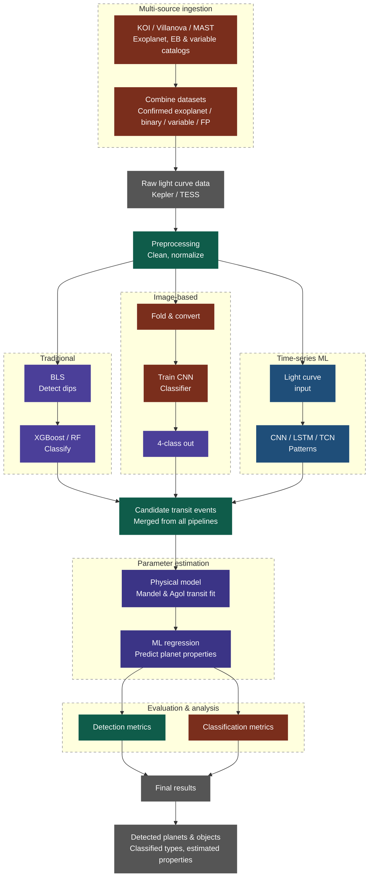

# 567 Machine Learning Project - Spring 2026

- [567 Machine Learning Project - Spring 2026](#567-machine-learning-project---spring-2026)
  - [Todo](#todo)
  - [Introduction](#introduction)
  - [Combined Project Flowchart](#combined-project-flowchart)
  - [Challenges](#challenges)
    - [The Data Challenge](#the-data-challenge)
  - [Links \& References](#links--references)

## Todo

- [ ] Merge datasets
  - [ ] Figure out why it takes 40s to query NASAExpArch
    - [ ] `compare-MAST-querying-methods.ipynb`
    - [ ] The Data Challenge
  - [ ] Develop script to combine all datasets

## Introduction

Project for CSCI 567 Machine Learning in Spring 2026 on light curve analysis of distant stars to detect exoplanets.

## Combined Project Flowchart

## Challenges

### The Data Challenge

When first starting to explore retrieving data with MAST, we noticed that it took close to 40s to run a query the NASA Exoplanet Archive with `astropy`. While this was to query the Archive and not MAST, we found that there was a different way to query MAST not just using `astropy`, but other methods as well.

These methods vary with different levels of convenience (and ease-of-use in syntax) but with the trade-off of having less control over the data/mission we were querying. Here's a table talking about ways to query the MAST dataset and what these methods allow you to have access to.

> [!TIP]
> These three are just different client layers on top of MAST and the difference in the efficiency comes down ot query overhead and how much client-side work happens before/after the download.

| Tool                                      | Scope                                                                                                                                                                                                                                                   | Best at                                                                                                                   | Kepler/K2-specific behavior                                                                                                                                                                                                         | Main trade-off                                                                                                                     |
| ----------------------------------------- | ------------------------------------------------------------------------------------------------------------------------------------------------------------------------------------------------------------------------------------------------------- | ------------------------------------------------------------------------------------------------------------------------- | ----------------------------------------------------------------------------------------------------------------------------------------------------------------------------------------------------------------------------------- | ---------------------------------------------------------------------------------------------------------------------------------- |
| **`Observations`**                        | The primary MAST interface for observational metadata and products across missions; it uses the MAST Portal API and returns Astropy `Table` objects. It is described as the recommended starting point for most users. ([astroquery.readthedocs.io][1]) | Cross-mission searches, rich metadata filters, product discovery, and downloads. ([astroquery.readthedocs.io][1])         | You can query Kepler/K2 as part of the broader archive, but it is mission-agnostic rather than Kepler/K2-specialized. ([astroquery.readthedocs.io][1])                                                                              | More flexible, but usually more manual filtering on your side. ([astroquery.readthedocs.io][1])                                    |
| **`MastMissionsClass` (“Kepler helper”)** | The mission-search class in `astroquery.mast`; astroquery’s docs separate this from the general observation search interface. ([astroquery.readthedocs.io][2])                                                                                          | Staying inside one mission’s data model and search flow. ([astroquery.readthedocs.io][2])                                 | This is the mission-specific layer you would use when your intent is “Kepler/K2 only,” rather than all of MAST. That is a mission-specific design choice, so it is narrower than `Observations`. ([astroquery.readthedocs.io][2])   | Less general than `Observations`; better for focused mission queries than archive-wide discovery. ([astroquery.readthedocs.io][2]) |
| **Lightkurve**                            | A domain-specific package for Kepler/K2/TESS time-series work. It says it uses Astroquery to search MAST and provides `search_lightcurve`, `search_targetpixelfile`, and `search_tesscut`. ([lightkurve.github.io][3])                                  | Fast light-curve and target-pixel-file workflows: search, download, plot, stitch, and filter. ([lightkurve.github.io][4]) | `search_lightcurve()` accepts an object name, **KIC or EPIC ID**, or coordinates; its `mission` filter includes **Kepler** and **K2** by default; it also supports `author`, `quarter`, and `campaign`. ([lightkurve.github.io][5]) | Best for light curves and TPFs, not for arbitrary archive products or broad metadata exploration. ([lightkurve.github.io][4])      |

[1]: https://astroquery.readthedocs.io/en/latest/mast/mast_obsquery.html "Observation Queries — astroquery v0.1.dev269+gf7db6753c"
[2]: https://astroquery.readthedocs.io/en/stable/mast/mast.html "MAST Queries (astroquery.mast) — astroquery v0.4.11"
[3]: https://lightkurve.github.io/lightkurve/tutorials/1-getting-started/searching-for-data-products.html "Searching & downloading Kepler, K2, and TESS data — Lightkurve "
[4]: https://lightkurve.github.io/lightkurve/reference/search.html "Downloading data — Lightkurve "
[5]: https://lightkurve.github.io/lightkurve/reference/api/lightkurve.search_lightcurve.html "lightkurve.search_lightcurve — Lightkurve "

Before we can apply machine learning techniques, or even build the combined dataset, we need to explore these ways of fetching MAST data and compare them for efficiency and use-case.

---

## Links & References

> [!NOTE]
>
> 1. [NASA EXP Archives](https://exoplanetarchive.ipac.caltech.edu/index.html)
> 2. [MAST Landing Page](https://mast.stsci.edu/portal/Mashup/Clients/Mast/Portal.html)
> 3. [MAST Notebook Repo](https://spacetelescope.github.io/mast_notebooks/notebooks/GALEX/mis_mosaic/mis_mosaic.html#about-this-notebook)
> 4. [Beginner Introductory Notebooks for `Lightkurve`](https://spacetelescope.github.io/mast_notebooks/notebooks/Kepler/beginner.html)
> 5. [Getting and Processing `Lightkurve` data](https://spacetelescope.github.io/mast_notebooks/notebooks/Kepler/lightkurve_analyzing_lc_products/lightkurve_analyzing_lc_products.html)
> 6. [Kaggle Notebook on Exoplanet Detection with CNNs](https://www.kaggle.com/code/huyghens/ai-model-for-the-detection-of-exoplanets/notebook#Future-work)
> 7. [Kaggle Notebook AI Model for the Detection of Exoplanets](https://www.kaggle.com/code/jaimetrickz/exoplanet-classification/notebook#KNN-Classifier)
> 8. [Kepler Eclipsing Binary Catalog](https://keplerebs.villanova.edu/)
