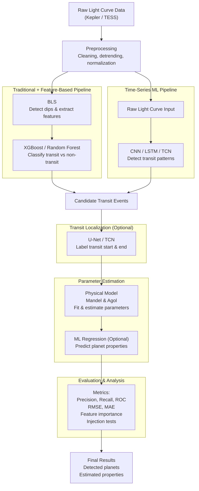
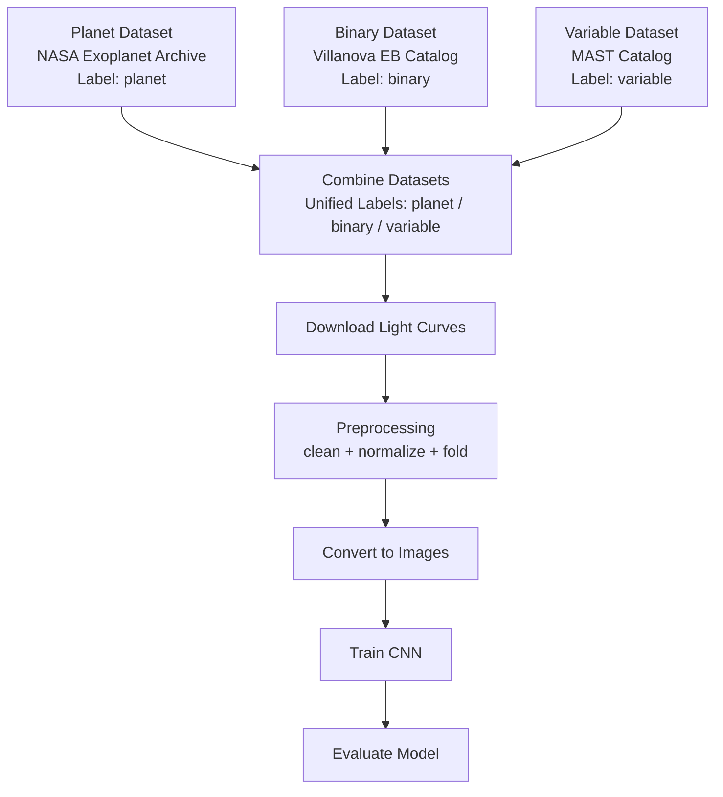

##### (i). Classifying TESS/Kepler events as transit, non-transit or false positive with 2 approaches

##### (ii). Classifying celestial objects into exoplanets, non exo, binary systems and variable stars

